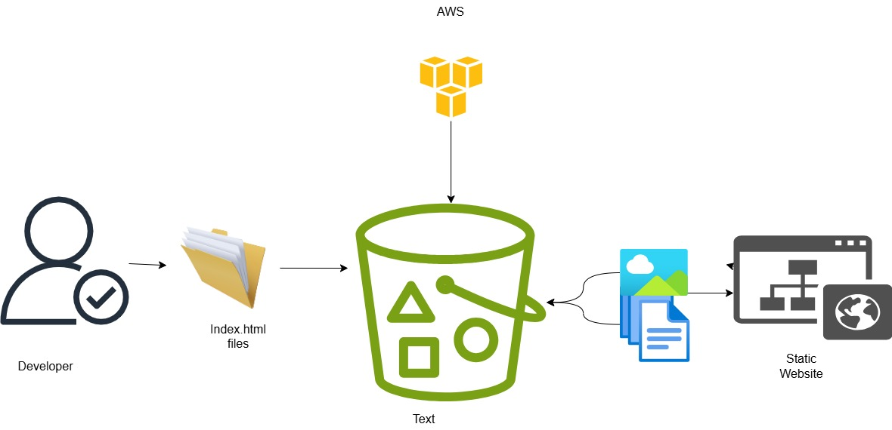

#  Building a Static Portfolio Website Using AWS S3

This project showcases a static portfolio website hosted on Amazon S3. It includes an architecture diagram and project structure designed for simplicity and accessibility using AWS Free Tier.

---

##  Project Overview

The process involved securing the AWS environment, hosting static files, and creating a detailed project record for cloud learning and demonstration.

---

##  Objectives

- Build a static portfolio site using only HTML/CSS
- Host it using S3 static website hosting (Free Tier)
- Secure the AWS environment using IAM and MFA


---

## 🏗️ Architecture Diagram



### 🔑 Key Components

| Component          | Description                                                                 |
|--------------------|-----------------------------------------------------------------------------|
| **S3 Bucket**       | Public bucket with static website hosting enabled                          |
| **HTML Files**      | `index.html` (home), `error.html` (404 page)                               |
| **Bucket Policy**   | Configured for public read-only access to web files                        |
| **IAM Setup**       | Root user MFA enabled; limited IAM access created                          |
| **Monitoring**      | (Optional) AWS S3 access logs for visibility and debugging                 |

---

## 🛠️ Prerequisites

Before starting, you should have:

-  An AWS account with [MFA enabled]
-  Basic understanding of HTML and AWS Console
- Git installed for documentation version control

>  Tip: Create a basic `index.html` homepage and a `404.html` (or `error.html`) — or use a free portfolio template.

---

##  Hosting Steps (AWS Console Only)

### 1. Enable MFA

Secure the AWS root account with Multi-Factor Authentication (MFA).

---

### 2. Create an S3 Bucket

- Use a unique bucket name 
- Uncheck **"Block all public access"** to allow site visibility

---

### 3. Enable Static Website Hosting

- Enable static website hosting from **Properties**
- Set `index.html` as the homepage
- Set `error.html` as the error page

---

### 4. Upload Your Website Files

- Upload `index.html`, `error.html`

---

### 5. Set Bucket Policy for Public Read Access

Replace `your-bucket-name` with your actual bucket name:

```json
{
  "Version": "2012-10-17",
  "Statement": [
    {
      "Sid": "PublicReadGetObject",
      "Effect": "Allow",
      "Principal": "*",
      "Action": "s3:GetObject",
      "Resource": "arn:aws:s3:::your-bucket-name/*"
    }
  ]
}
